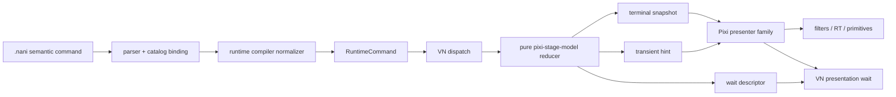

# Archived: Pixi Effect Lab Visual Design And Implementation Notes

> Archived on 2026-08-09. This is a historical batch design record, not active
> architecture or Nani authoring documentation. The command catalog owns current
> command usage; `docs/architecture/pixi-effects.md` owns current architecture.

## Purpose

This branch is a development-only, high-end desktop experiment for nine
semantic Nani effects. It validates the complete authoring path, develops a
shared visual language for the project's oppressive / melancholic / grotesque
material, and leaves a concrete reference for future Pixi effects.

The lab does not filter DOM dialogue, choices, menus, or accessibility UI. The
script contains deliberately strong flicker and therefore opens with a warning
and a route that skips that section. Product adoption requires a separate
photosensitivity review against the W3C
[Three Flashes guidance](https://www.w3.org/WAI/WCAG22/Understanding/three-flashes-or-below-threshold).

## End-To-End Architecture



The ownership boundary is intentionally one-way:

1. `packages/contracts` owns public command IDs, semantic params, schemas, task
   kinds, and terminal snapshot shapes. This branch records the public change in
   `docs/ccr/pixi-effect-lab.md`.
2. `packages/nani-runtime-compiler` supplies defaults and rejects invalid
   colors, enums, counts, vectors, non-finite values, seeds, and easing names.
   It never contains rendering behavior.
3. `packages/pixi-stage-model` is pure. One-shots produce hints and tasks;
   persistent effects produce optional terminal snapshot fields, removal hints,
   and tasks. Hand-injected invalid IR is rejected here a second time.
4. `packages/pixi-presenter` owns every Pixi object, shader, tween, captured
   texture, display primitive, resize operation, and cleanup action.
5. Game A development content and Devtools exercise the public route without
   adding a product runtime boundary or production content entry.

Snapshot version 6 remains unchanged. Persistent snapshots retain only terminal
semantic values. Phase, captured history, particles, live interpolation, and GPU
resources are intentionally absent from save data; `animate:false` restores a
terminal state with a new empty history.

## The Recommended “Add A Pixi Effect” Workflow

Use the project's canonical [Adding a Pixi effect](../architecture/adding-pixi-effect.md)
guide. The concrete sequence proven by this lab is:

1. Choose weather, persistent screen, actor, or transient ownership before
   naming the command. Write a CCR for public command or IR changes.
2. Add semantic contract params. Do not expose shader uniforms, texture sizes,
   pass counts, or renderer-specific blend modes.
3. Add one compiler normalizer with defaults and strict authoring validation.
   Preserve replay determinism with finite decimal seeds and canonical color/vector
   forms.
4. Add one pure Stage reducer. Decide terminal snapshot versus finite hint,
   emit the matching wait descriptor, and add restore/no-op/invalid tests.
5. Register one Presenter leaf in an existing fixed family. The leaf must cover
   creation, same-family replacement, sibling coexistence, interruption,
   resize, settle/cancel, clear, destroy, and resource return.
6. Put technical assets inside the Presenter, never the App manifest. Prefer a
   shader or deterministic Pixi primitive when it is a better source than a
   bitmap.
7. Add separate development Nani scenes for strictly isolated effect samples
   and for compositions/stress. The isolated scene removes each persistent
   effect before starting the next and contains no replacement or cross-effect
   sequence. Each scene owns its final cleanup. Expose read-only Devtools state.
8. Run unit/contract/boundary/build gates, then a real WebGL browser pass with
   screenshots, console checks, terminal-state checks, and an explicitly
   identified performance environment.

An important lifecycle detail is that a terminal snapshot retains its authored
transition object after its command finishes. A controller must distinguish an
actual family update from an unrelated Stage revision; otherwise old `wait!`
transitions are replayed. Actor-local filters must likewise preserve filters
owned by other controllers instead of assigning the entire filter array.

## Presenter Composition Policy

Persistent root-filter order is fixed:

```text
bokeh → waterVeil → pulse → staticFilter → glitch → vignette → transient filters
```

Water distorts the source first. Pulse extracts contours from that processed
scene. Static and glitch then destroy signal coherence. Vignette preserves the
composition's stable pressure at the end, while one-shots retain final emphasis.
`signalMask` is inserted after actor tone and before the white outline,
including both sides of expression crossfade.

Continuous numeric values, including effect colors and Pulse origin, interpolate
from the current live value. Rate/speed parameters integrate phase (`phase +=
dt * liveRate`) so editing a speed does not rewind or jump the animation. Palette,
seed, region, and shape remain deliberate discrete boundaries.

Pulse and Afterimage capture filter input into Presenter-private, half-resolution
textures obtained from Pixi's texture pool. A capture remains frozen for the
effect event; it is recaptured on a Pulse beat, first use, or resize and is always
returned on replacement/destroy. Pixi's filter and resource guidance is the
baseline for this ownership policy:
[Filters](https://pixijs.com/8.x/guides/components/filters),
[Performance tips](https://pixijs.com/8.x/guides/concepts/performance-tips), and
[Garbage collection](https://pixijs.com/8.x/guides/concepts/garbage-collection).

## One-Shot Effects

### `impact`

Intent: a sudden physical or psychological blow, not a generic camera zoom.

Processing chain:

1. A fast exponential attack derives a high-contrast edge/highlight matte with
   central-difference samples.
2. A three-sample directional/radial gather produces a short smear centered on
   the semantic `origin` and corrected for aspect ratio.
3. Edge exposure and channel-separated samples harden the initial impact.
4. A damped overshoot restores the scene after the main deformation.

The visual envelope spends roughly 12% on compression/exposure, 26% on smear
and chroma, and the remainder on an over-shooting recovery. Baseline `easeOut`
is the authoring default. This combines ideas from Adobe's
[Directional/Radial Blur and Sharpen](https://helpx.adobe.com/after-effects/desktop/apply-effects-and-animation-presets/list-of-effects/blur-sharpen-effects.html)
without applying a costly full blur pass.

### `afterimage`

Intent: an Echo-like memory fracture formed from contours and highlights, not
several transparent copies of the live image.

Processing chain:

1. The initial filter input is captured once at half resolution. An actor target
   captures its local composed actor; `stage` captures the full Pixi scene.
2. Two to six non-equidistant offsets sample only the frozen history.
3. Four local taps derive edge/highlight energy per layer. Tint, exponential
   `decay`, and a controlled quadratic spacing term separate the echoes.
4. Actor output reconstructs premultiplied alpha from history so echoes can exist
   outside the current silhouette without rectangular color fringes.
5. Dynamic padding is derived from count, offset, and viewport dimensions; Blur
   reconciliation preserves the transient filter in the actor-owned stack.

The time-domain precedent is Adobe's
[Echo and Time Displacement](https://helpx.adobe.com/in/after-effects/desktop/apply-effects-and-animation-presets/list-of-effects/time-effects.html).

### `shutter`

Intent: an eyelid, iris, or slicing occlusion that feels bodily and lens-bound.

Processing chain:

1. Total seconds are partitioned into close, authored hold, and open intervals.
2. Close and open are partitioned inside the shader while the command uses only
   the baseline easing vocabulary.
3. Shape distance fields are anti-aliased at viewport pixel scale. Eyelid edges
   receive a small low-frequency skew disturbance.
4. Near closure, a localized lens pinch, desaturation, and cool black bias build
   pressure before the opaque mask takes over.

The semantic shape set mirrors the design vocabulary of Adobe's
[Iris and Linear Wipe effects](https://helpx.adobe.com/in/after-effects/using/transition-effects.html),
implemented as one real-time distance-field pass.

### `flicker`

Intent: a violent signal rupture with distinct destructive operators, replacing
both a simple flash and the earlier `signalDrop` concept.

Processing chain:

1. The seeded duration is partitioned into exactly `bursts` event slots. Each
   slot receives an irregular center and pulse width.
2. Events cycle deterministically through black cut, invert, white clip, and
   solarized/level-damaged operators, ensuring a seed cannot accidentally yield
   only one kind of flash.
3. Seeded horizontal bands receive independent displacement; RGB channels lag
   the damaged sample by different amounts.
4. Posterization reinforces level failure, and a final short chromatic afterburn
   outlives the last white/black event.

This uses the operator vocabulary of Adobe's
[Strobe Light and stylize effects](https://helpx.adobe.com/ca/after-effects/desktop/apply-effects-and-animation-presets/list-of-effects/stylize-effects.html).
It intentionally exceeds a generally safe flash cadence in the opt-in lab only.

## Persistent Effects

### `vignette`

Intent: stable claustrophobic framing with nearly subliminal breathing.

An aspect-correct elliptical distance field receives a fixed low-frequency
organic offset and a much slower radius drift. The edge grades toward dark
purple-red, compresses midtones, and adds signed grain strongest in the toe.
`breathe` never scales the scene and remains visually distinct from Pulse.

### `staticFilter`

Intent: a snow-wall / CRT signal texture that physically deforms the image.

Processing chain:

1. Seeded spatial noise and time-quantized snow build the high-frequency layer.
2. Fine scanline luminance and wider randomly phased line bands vary in thickness
   and intensity.
3. The wide-band value drives local horizontal UV tear. `jitter` controls band
   activity while `warp` controls displacement magnitude, so either can be tuned
   independently.
4. Opposing R/B delay, posterized snow, black-level pressure, and a terminal
   radial vignette build an analog-signal hierarchy.
5. `cold`, `sepia`, `green`, and `mono` choose discrete grading transforms.

The relevant offline precedents are Adobe's
[Noise and Grain](https://helpx.adobe.com/uk/after-effects/desktop/apply-effects-and-animation-presets/list-of-effects/noise-grain-effects.html)
and [Displacement Map](https://helpx.adobe.com/uk/after-effects/desktop/apply-effects-and-animation-presets/list-of-effects/distort-effects.html).
True spatiotemporal blue noise is a future technical-asset option; NVIDIA's
[STBN overview](https://developer.nvidia.com/blog/rendering-in-real-time-with-spatiotemporal-blue-noise-textures-part-1/)
is the reference, but the current experiment remains asset-free and seeded.

### `waterVeil`

Intent: first-person dampness and drowning pressure, without an all-screen sine
wave.

Two noise scales create a slowly evolving flow field. Seeded cells produce
independently phased falling heads and tapering trails. Their field drives local
refraction, followed by a three-tap directional/compound blur, cold tint curve,
and wet highlight. `level`, `ripple`, `drift`, `blur`, and `droplets` therefore
control separate perceptual stages. The processing vocabulary follows Adobe's
[Turbulent Displace, Displacement Map, and Compound Blur](https://helpx.adobe.com/uk/after-effects/desktop/apply-effects-and-animation-presets/list-of-effects/distort-effects.html).

### `signalMask`

Intent: corrupt a character's identity while keeping the white silhouette
recognizable.

The effect is installed once on the actor's outer composited container, after
character-internal tone/outline and before Blur and actor-local transients. It
processes the complete character with held horizontal bands, local sample
replacement, mosaic/posterization, threshold noise, and opposing R/B delay.
Both sides of a crossfade therefore share one filter and phase. Processing is
performed in straight RGB and re-premultiplied by the original actor alpha, so
transparent pixels cannot emit rectangular noise or colored fringes.

### `pulse`

Intent: a tense first-person heartbeat perceived as expanding extracted shells,
not a periodically zooming screenshot.

Processing chain:

1. Integrated BPM phase generates a fast primary attack/exponential decay, a
   35%-strength secondary beat, and a long rest.
2. The beginning of each primary beat captures a half-resolution frozen input.
3. Two to four shells use nonlinear radius, independent decay, angular/tangential
   distortion, directionally separated taps, chroma delay, and edge/highlight
   extraction.
4. The live base image remains spatially invariant. Only frozen extracted shells
   expand; apparent center compression comes from their inward/outward contrast,
   not a base UV zoom.
5. Resize requests a new capture; restore starts with empty history; clear and
   destroy return the pooled texture.

The visual lineage combines Adobe's Echo/Radial Blur vocabulary with real-time
edge filtering concepts from NVIDIA's
[high-quality filtering chapter](https://developer.nvidia.com/gpugems/gpugems/part-iv-image-processing/chapter-24-high-quality-filtering).

## Development Script And Diagnostics

`apps/game-a/src/nani-dev/pixi-effect-lab.nani` and
`apps/game-a/src/nani-dev/pixi-effect-compositions.nani` are discovered by the
existing development catalog and excluded from production content. Together
they provide:

- an isolated-effect lab with full and skip-Flicker routes;
- low/mid/high one-shot samples that each finish before the next sample;
- isolated persistent creation, stable observation, and timed `power:0 wait!`
  removal before the next effect begins;
- a separate composition scene for domestic pressure, broken television, and
  drowning;
- full filter-stack stress, weather coexistence, isolation removal, and final
  cleanup in both scripts.

The development text snapshot exposes one canonical `pixi.snapshot` plus
runtime hints, animation state, and active presentation tasks. This is read-only harness
observability; none of it is added to the product VN runtime boundary.

## Performance Validation

The browser smoke always records profiles and only enforces hardware budgets
when `PIXIEFFECT_PERF_ASSERT=1`. This avoids treating SwiftShader, energy-saving
CI, or a remote VM as the declared high-end desktop target.

Performance sampling is separate from functional assertions. The generated
`test-results/game-a-effects-performance.json` contains Domestic Pressure and
full persistent-stack measurements; budgets remain opt-in.

These are `requestAnimationFrame` frame intervals, not disjoint GPU timer-query
results. They validate delivery cadence and the requested median budgets but
cannot isolate GPU pass time below vsync. Rare maxima around 58 ms occurred in
Pulse and stress sampling; the smoke therefore records p95 and over-budget ratios
alongside the required median rather than hiding spikes.

## Asset Decision

No new bitmap, generated image, dependency, App manifest entry, or lockfile
change is needed. The effects depend on exact seeds, technical masks, procedural
geometry, and live scene sampling; shader math and Pixi primitives are more
appropriate than image generation for those requirements. A future true
blue-noise/STBN texture should be sourced or generated as a verified technical
resource inside the Presenter, not improvised as decorative AI imagery.
